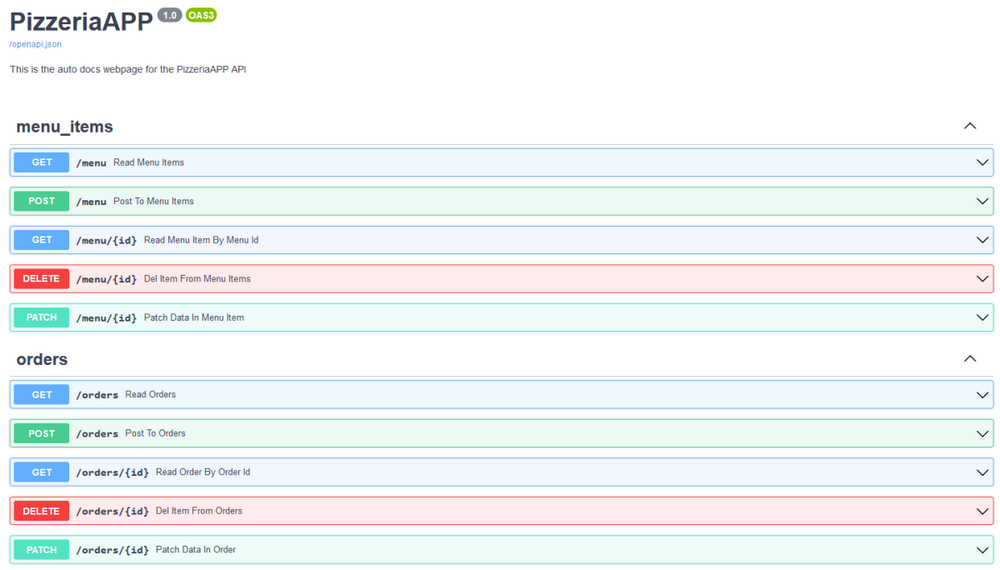
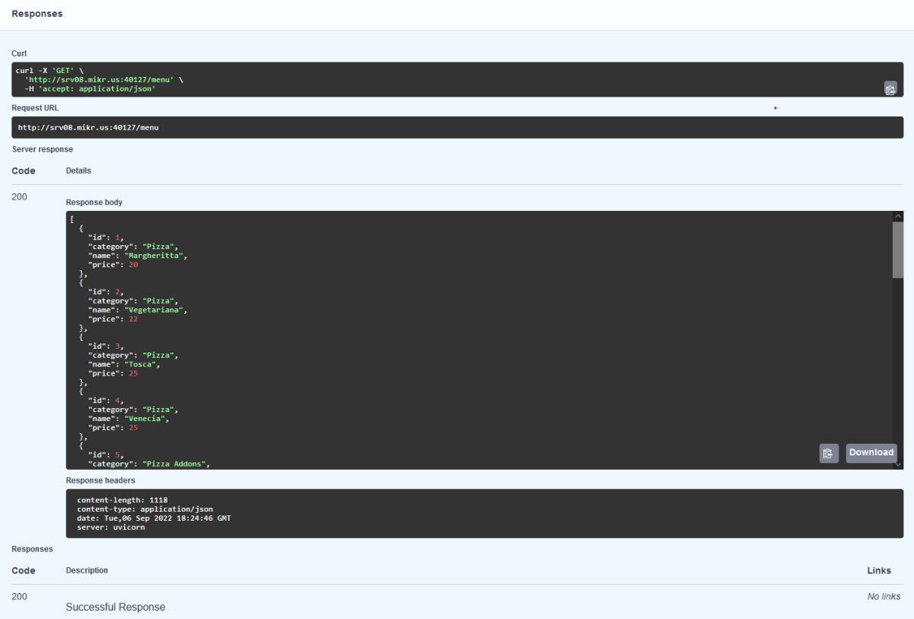
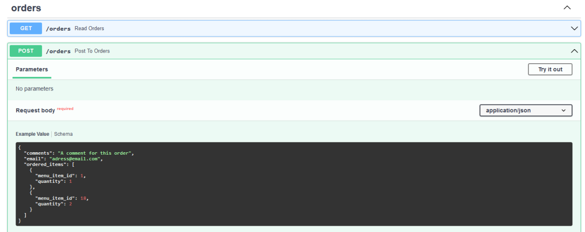
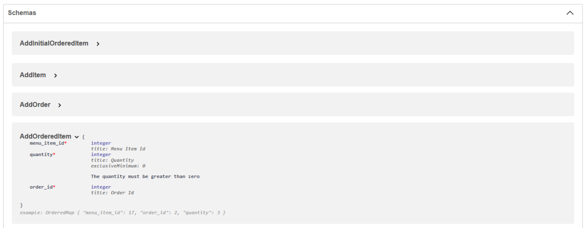
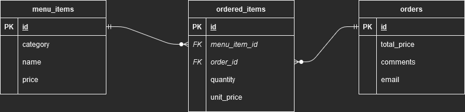

# PizzeriaAPP
Project for self learning purposes - featuring: API (FastAPI), containers (Docker), ORM (SQLAlchemy), raw SQL and database (PostgreSQL) usage. 

Simulates a working pizza place.

You can preview the app at: http://srv08.mikr.us:40127/docs

## Setup

1. Fill in required details in *.env* and *database.ini* files (in root of repo):

***.env***

```
POSTGRES_DB=pizzeria
POSTGRES_USER=postgres
POSTGRES_PASSWORD=PizzeriaPassword
POSTGRES_EXTERNAL_PORT=5432
PIZZERIA_EXTERNAL_PORT=8000

```

***database.ini***

```
[postgresql]
host=host.docker.internal
port=5432
user=postgres
password=PizzeriaPassword
database=pizzeria
database_url=postgresql://%(user)s:%(password)s@%(host)s:%(port)s/%(database)s
use_orm=False

```

2. Run command: `docker-compose up -d`
3. App should be running at: http://localhost:8000/docs

## Screenshots









## Requirements for the simulated task

- Filled menu with many positions, names, prices and categories
- Should allow to pick any combination of menu positions
- Should let users pick each position many times
- Total price of a single order should be updated live
- Should store a history of orders

## Entity-Relationship Diagram


## Skills used
- dockerized PostgreSQL database and APP
- created a functioning API with FastAPI
- implemented CRUD functionality
- applied ORM with SQLAlchemy and raw SQL (and an option in *src/database.ini* to select which one to use)
- prepared end2end RestAPI tests collection in Postman (and an additional simpler version to use with pytest)
- hosted the PizzeriaAPP

### Possible improvements
- improve project structure (organize the code into controllers, services, etc.)
- prepare a better database that adds a relation between main dishes and addons (now theoretically you can pick just an addon from the menu)
- provide a way to store history of orders and ordereditems (even for items that are deleted such as menu positions)
- implement authorization to restrict database access (for example restrict menu_items table only to admin)
- develop front-end for the app